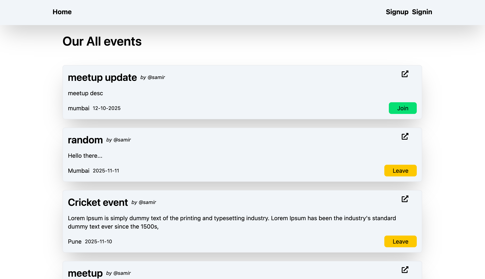
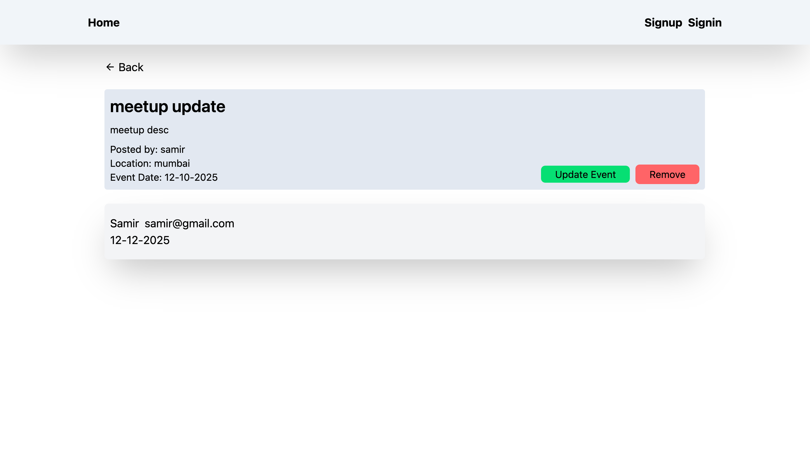
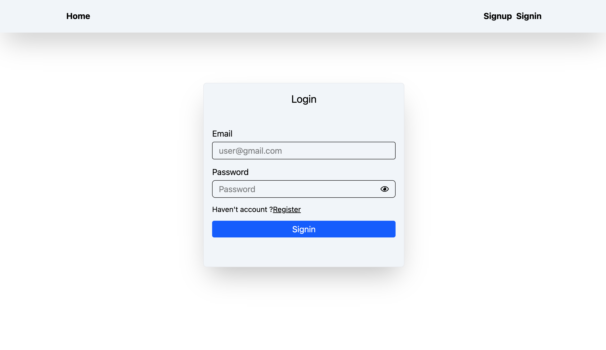
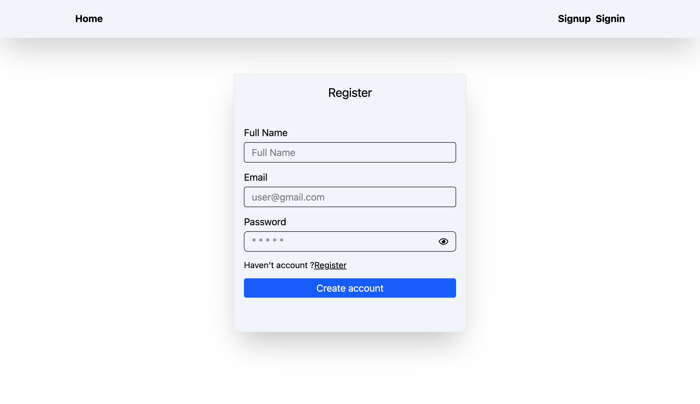
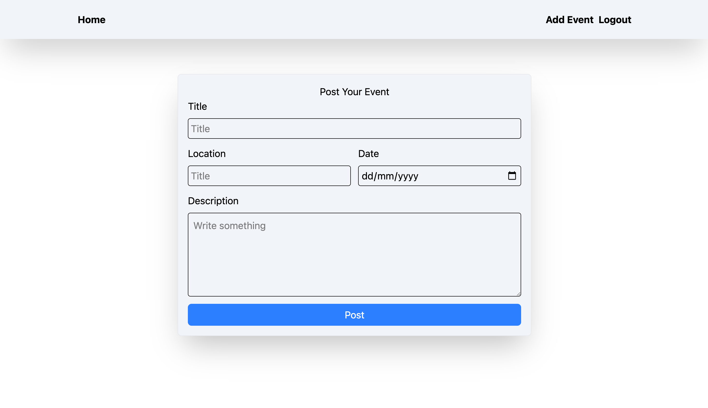

# Event-Managment

## About the project

Event-app is a full-stack Event Management System that allows users to create, manage, and book events effortlessly. It provides an easy-to-use interface for organizers to handle event details, bookings, and attendees—all in one place.


- **User Control**:
  - User can SignIn, SignUp, Logout.
  - User can post update and remove an event.
  - Also user can join and leave an event

---


## Installation 

To set up the Airbnb on your local machine, follow these steps:

1. **Clone the Repository**:
    ```bash
    git clone https://github.com/warsi0707/event-app
    ```

2. **Install Dependecies**:
    ```bash
    cd backend
    npm install
    ```

    ```bash
    cd frontend
    npm install
    ```

3. **Run the Application**:
    ```
    backend
    npm start
    ```
    ```
    frontend
    npm run dev

    ```

---

## Technologies Used

- **Frontend**:
  - React.js: For building the user interface.
  - Redux: For managing state
  - React-Router: For navigation.
  - react-hot-toast: For pop-up status message.
  - Tailwind CSS: For styling components.


- **Backend**:
  - Node.js: For server-side logic.
  - Express.js: For building the RESTful API.

- **Database**:
  - Postgres: For storing user and transaction data.

- **ORM**:
  - Prisma

- **Authentication**:
  - JSON Web Tokens (JWT): For secure user authentication.

- **Others**:
  - Fetch: For making HTTP requests.
  - dotenv: For managing environment variables.
  - bcrypt: For password hashing.
  - cors: For connect backend and frontend
  - Localstorage: for storing some data

---

## Screenshots

### Homepage


### Event detaild


### Signin page


### Signup


### Event post


### Update event


